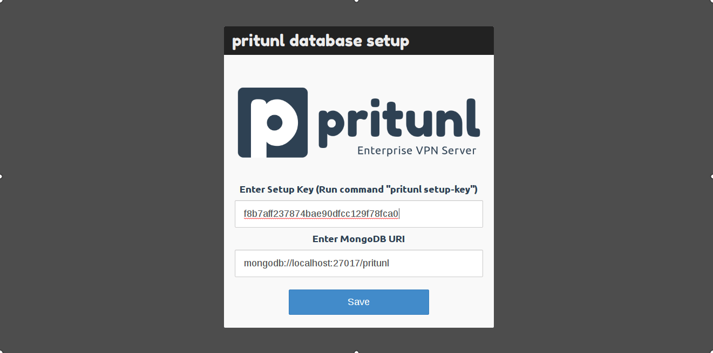
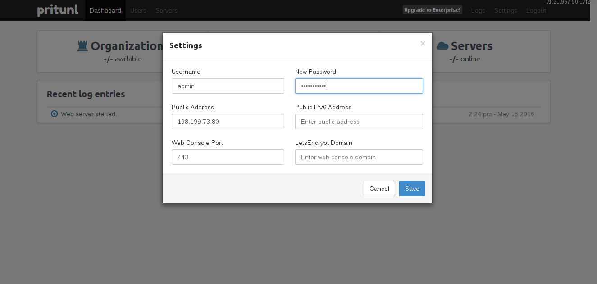
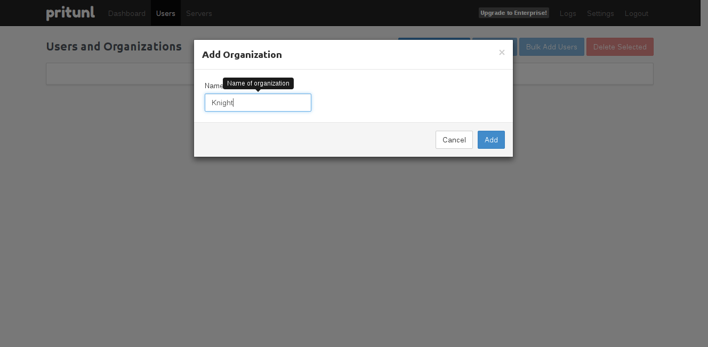
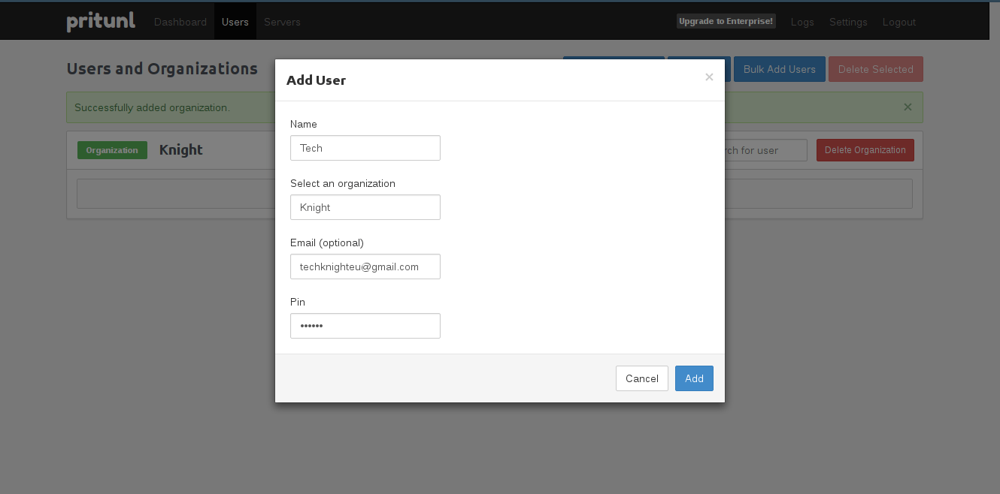
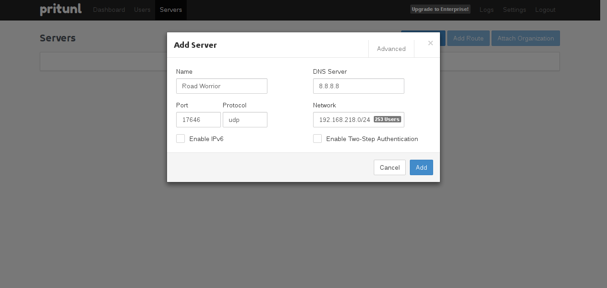
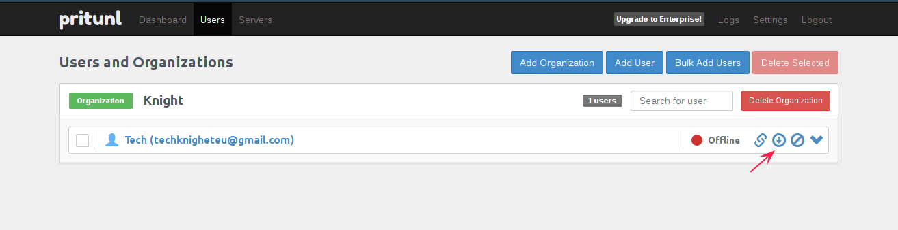

Introductioin

COME UP WITH SOME CLEVER SHIT HERE

#### Install MongoDB & Pritunl

First add mongodb to apt sources list.
```
echo "deb http://repo.mongodb.org/apt/ubuntu trusty/mongodb-org/3.0 multiverse" > /etc/apt/sources.list.d/mongodb-org-3.0.list
```
and then pritunl as-well.
```
echo "deb http://repo.pritunl.com/stable/apt trusty main" > /etc/apt/sources.list.d/pritunl.list
```

Add the apt-keys for the two repos so apt can validate them.
```
apt-key adv --keyserver hkp://keyserver.ubuntu.com --recv 7F0CEB10
apt-key adv --keyserver hkp://keyserver.ubuntu.com --recv CF8E292A
```

We have added two repos to our apt sources list now, the next thing on the list is going to be update the list and then install MongoDB and Pritunl

```
sudo apt-get update && sudo apt-get install mongodb pritunl
```

I am assuming you are using UFW as your firewall. We are going to open a couple of ports to get access to the web UI and also to be able to connect to the VPN.
```
sudo ufw enabled
sudo ufw allow http
sudo ufw allow https
sudo ufw allow 12973/udp
sudo ufw enabled
sudo ufw reload
```

```
sudo service pritunl start
```

We are going to need a setup key in a few seconds so create the key now and copy it for later use

```
pritunl setup-key
```

Go to the browser and enter the IP of your server, make sure to connect with HTTPS otherwise you will get a connection refused.
You will see that the site isn't secure because it is a self-signed certificate (which is fine if you are the only user, otherwise I would recomend to get one for free at [let's encrypt](https://letsencrypt.org)).  
  
Insert the key we created and copied earlier and login (default credentials is user : `pritunl`, password: `pritunl`.)



Change the login credentials and if you have a domain name then insert it under Let encrypt domain name to get a free SSL certificate.



Next head over to "users" and create an organization and then create a user and add it to that organization





Select a name for the VPN, the port is already opened and you can use what ever DNS address you want to use, I've made a simple list of some of the most popular choices in the table below. 

| DNS Provider Name 	| Primary DNS Server 	| Secondary DNS Server 	|
|-------------------	|--------------------	|----------------------	|
| Google            	| 8.8.8.8            	| 8.8.4.4              	|
| FreeDNS           	| 37.235.1.174       	| 37.235.1.177         	|
| Quad94            	| 9.9.9.9            	| 149.112.112.112      	|
| OpenDNS Home6     	| 208.67.222.222     	| 208.67.220.220       	|
| Cloudflare18      	| 1.1.1.1            	| 1.0.0.1              	|



The next thing will be to connect to the VPN I am using a OpenVPN Client on my Android phone, Ipad and Computer so download your preferred client and download the .opvn file from pritunl in order to connect to the server(it is found under user).


