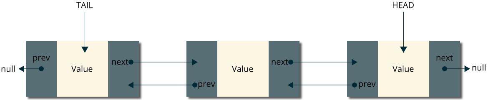

---
path: '/doubly-linked-list'
title: 'Doubly linked list from scratch'
image: '../../images/new-soon.png'
date: '2018-07-22'
type: 'cs'
published: true 
----------------------------------------------------------



## Java Implementation
```java
public class DoublyLinkList<Value> {

    private Node head;
    private Node tail;
    private int size;
    
    public DoublyLinkList(){
        head = null;
        tail = null;
        size = 0;   
    }

    public void addFirst(Value data) {
        Node node = new Node(data);

        if (head == null) {
            node.next = null;
            node.prev = null;
            head = node;
            tail = node;

        } else {
            head.prev = node;
            node.next = head;
            node.prev = null;
            head = node;
        }
    }

    public void addLast(Value value){
        Node newLast = new Node(value);
        newLast.prev = tail;
        tail.next = newLast;
        tail = newLast;
    }

    public void deleteFirst(){
        head = head.next();
        head.setPrev(null);
    }

    public void deleteLast() {
        tail = tail.prev();
        tail.setNext(null);
    }

	public void insertFirst(Value value){
			Node newFirst = new Node(value);
            newFirst.next = head;
            head.prev = newFirst;
            head = newFirst;
		}

    public void insertLast(Value value) {
        Node newLast = new Node(value);
        tail.next = newLast;
        newLast.prev = tail;
        tail = newLast;     
            
    }

    public int getSize(){
        return size;
    }

    public boolean isEmpty() {
        return (head == null);
    }

    public void printList(){
        Node current = head;

        while( head != null ){
            System.out.println(current);
            if (current.next() != null) current = current.next();
            else break;
        }

    }

    private static class Node<Value> {

			Value val;
			Node next;
			Node prev;

			public Node(Value val) {
				this.val = val;
			}

			public Node next(){
				return next;
			}

			public Node prev(){
				return prev;
			}

			public void setNext(Node newNext){
				next = newNext;
			}

			public void setPrev(Node newPrev){
				prev = newPrev;
			}

			public Value getValue(){
			    return val;
            }

			@Override   
			public String toString(){
				return val.toString();
			}
		}

}
```
